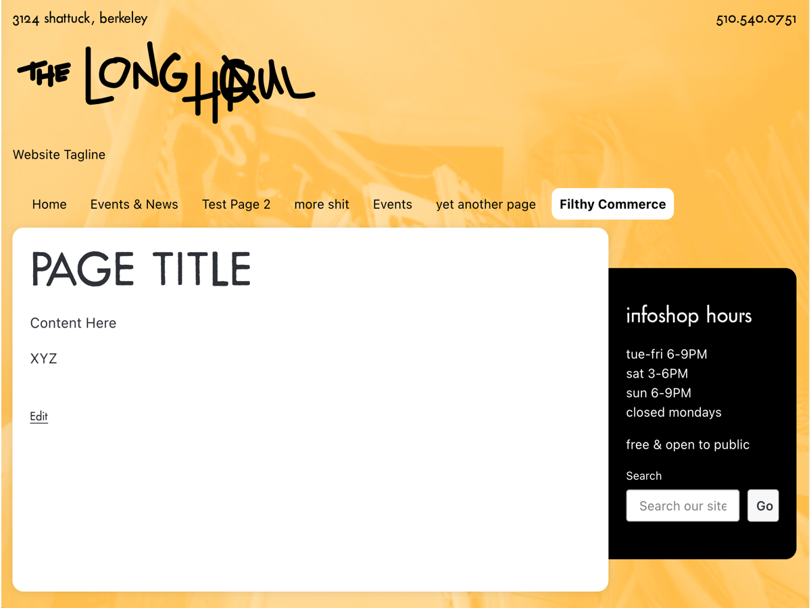

# fruitfly-wp
wordpress theme for www.thelonghaul.org

## How to install and setup
1. Upload the folder called `fruitfly` to wp-content/themes/
2. Install and enable the [Advanced Custom Fields plugin](https://wordpress.org/plugins/advanced-custom-fields/)
3. In the admin sidebar, find the **Custom Fields** section, then click on **Tools**. Find the box that says "Import Field Groups" and upload the file called `acf-export.json`.

## Notes
Based on [_s](https://github.com/automattic/_s)

## Preview screenshot

